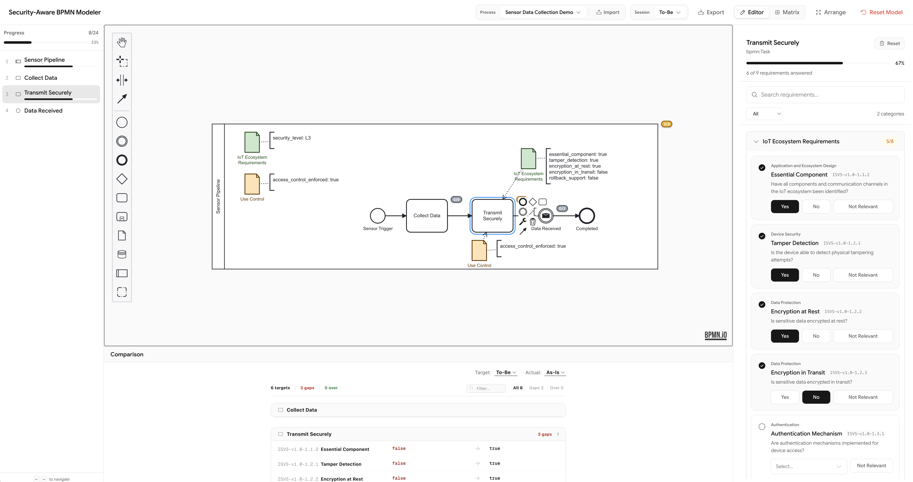

# SRA — Security-Aware BPMN Modeler

A web-based tool for embedding security requirements directly into BPMN 2.0 process diagrams. SRA maps standard-specific
compliance criteria (e.g., [OWASP IoT Security Verification Standard](https://owasp.org/www-project-iot-security-verification-standard/) — ISVS v1.0) onto BPMN element types, letting
auditors and process designers assess security posture in the same notation they use to model business processes.
Dual-session comparison (As-Is vs. To-Be) surfaces compliance gaps, while automatic visual annotation keeps the diagram
readable.



## Architecture

SRA models the relationship between security standards, process models, and audit evidence through a normalized
relational schema (SQLite / Drizzle ORM):

| Layer      | Table                              | Role |
|------------|------------------------------------|------|
| Standard   | `regulation_standard`              | A security framework (e.g., ISVS v1.0) |
| Requirement | `compliance_requirement`          | A single rule from the standard |
| Attribute  | `evaluation_attribute`            | Measurable property with input type, BPMN scope, and annotation template |
| M:N Link   | `compliance_requirement_attribute` | Associates requirements with the attributes that verify them |
| Process    | `business_process`                | A BPMN 2.0 XML definition |
| Element    | `process_element`                 | A BPMN shape (Task, Message Event, Pool, Lane) within a process |
| Assessment | `audit_assessment`                | A named audit session (As-Is / To-Be) tied to one process |
| Evidence   | `assessment_value`                | A recorded answer for one (assessment, attribute, element) triple |

Each evaluation attribute declares which BPMN element types it applies to (`Task`, `Message Event`, `Pool`, `Lane`).
When an auditor clicks a shape on the BPMN canvas, the sidebar shows only the requirements relevant to that element
type. Answers are stored at the (element, attribute) granularity and rendered as colored Data Object References + Text
Annotations directly on the diagram.

## Dataset

The seed script (`src/db/seed.ts`) populates the database with 11 ISVS v1.0 requirements covering:

- **IoT Ecosystem Requirements** — Application & Ecosystem Design (1.1.1–1.1.3), Device Security (1.2.1), Data
  Protection (1.2.2–1.2.3), Authentication (1.3.1), Authorization (1.3.2), Software Updates (1.4.1–1.4.2)
- **Use Control** — Access Control (2.2.1)

Each requirement carries an external ID, question text, input type (BooleanToggle / Dropdown / TextInput), BPMN element
mapping, and an annotation template. The mapping is defined in `src/lib/mapping.json` and can be extended with
additional standards.

The seed also creates a demo process ("Sensor Data Collection Demo") — a simple 4-step BPMN diagram (Sensor Trigger →
Collect Data → Transmit Securely → Data Received → Completed) with a default To-Be assessment.

## Quick Start

**Prerequisites:** Node.js ≥ 20

```bash
npm install
npm run dev:setup        # generates migrations, seeds DB, starts dev server
```

Open http://localhost:3000/modeler/

### Step-by-step setup

```bash
npm install
npm run db:generate       # generate SQL migration from Drizzle schema
npm run db:migrate        # apply migration to sra.db
npm run db:seed           # populate ISVS requirements and demo process
npm run dev               # start Vite dev server on port 3000
```

### Docker

```bash
docker build -t sra .
docker run -p 8080:80 sra
```

## Extending with Additional Standards

1. Add entries to `src/lib/mapping.json` following the existing structure (id, requirement, question, category,
   subcategory, external_id, bpmn_mapping, further_specification, bpmn_annotation, bpmn_template).
2. Run `npm run db:seed` to re-populate the database.
3. Update `src/lib/bpmn-extensions.ts` `CATEGORY_COLORS` if new categories need distinct visual styling.
